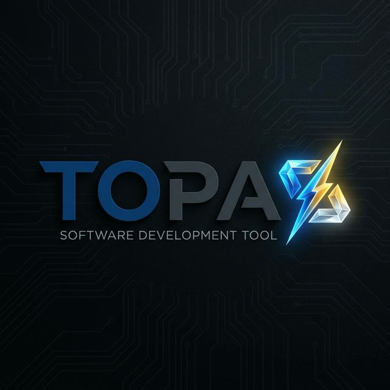
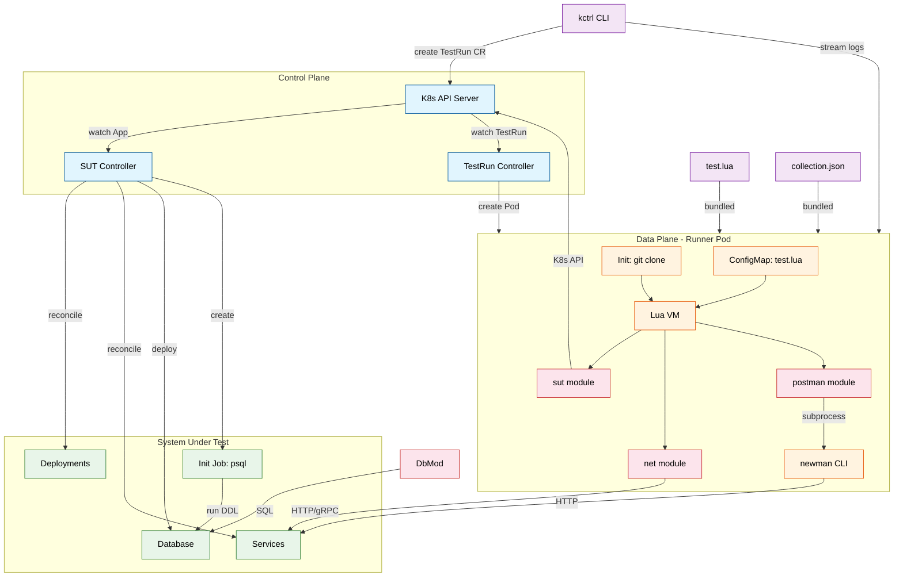

# TOPAS: Test Orchestration Platform



TOPAS (Test Orchestration Platform for Application Systems) is a Kubernetes-native framework for orchestrating complex, granular system tests using Lua scripting. It bridges the gap between simple unit tests and full-blown end-to-end integration tests by providing a programmable environment to manipulate system state, network traffic, and database content.

## Architecture



## Core Concepts

### System Under Test (SUT) Controller
The `App` CRD acts as the "Inventory" and "Control Plane" for the system being tested. It manages the lifecycle of the application, including services and databases, ensuring the environment matches the desired state for testing.

### Test Framework
Orchestrate tests using the `TestRun` CRD. Tests are written in Lua, allowing for dynamic logic, intricate flow control, and deep integration with the system components.

## Features

- **Lua Scripting**: Write powerful procedural tests with a rich standard library.
- **SUT Management**: Update service versions, scale replicas, and manage database schemas directly from your test script.
- **Network Client**: Built-in HTTP and gRPC clients for interacting with your services.
- **Database Access**: Direct SQL access to seed data and verify state.
- **Postman Integration**: Run existing Postman collections as part of your test workflow.

## Quick Start

### Prerequisites
- go version v1.24.6+
- docker version 17.03+.
- kubectl version v1.11.3+.
- Access to a Kubernetes v1.11.3+ cluster.

### Installation

1. **Install CRDs**:
    ```sh
    make install
    ```

2. **Deploy Controller**:
    ```sh
    make deploy IMG=<your-registry>/topas:tag
    ```

## Usage

### 1. Define your App
Create an `App` manifest to define your system stack.

```yaml
apiVersion: topas.io/v1alpha1
kind: App
metadata:
  name: my-app
spec:
  services:
    - name: frontend
      image: my-org/frontend:v1.0
      port: 8080
  databases:
    - name: main-db
      image: postgres:15
      port: 5432
      credentials:
        user: admin
        password: password
        dbname: appdb
```

### 2. Schedule a Test
Run a test using the CLI or by applying a `TestRun` CR.

**Using CLI:**
```sh
kctrl test schedule --script test.lua --app my-app
```

**Lua Script (`test.lua`):**
```lua
local sut = require("sut")
local net = require("net")

-- Verify initial state
local resp = net.get("http://frontend/health")
assert(resp.code == 200)

-- Update version
sut.apply_service("frontend", { image = "my-org/frontend:v1.1" })
sut.wait_ready("frontend", "60s")

-- Verify upgrade
resp = net.get("http://frontend/api/version")
assert(resp.body == "v1.1")
```

### 3. Check Results
```sh
kctrl test status <run-name>
# Stream logs
kctrl test logs <run-name>
```

## License

Copyright 2026.

Licensed under the Apache License, Version 2.0 (the "License");
you may not use this file except in compliance with the License.
You may obtain a copy of the License at

    http://www.apache.org/licenses/LICENSE-2.0

Unless required by applicable law or agreed to in writing, software
distributed under the License is distributed on an "AS IS" BASIS,
WITHOUT WARRANTIES OR CONDITIONS OF ANY KIND, either express or implied.
See the License for the specific language governing permissions and
limitations under the License.
