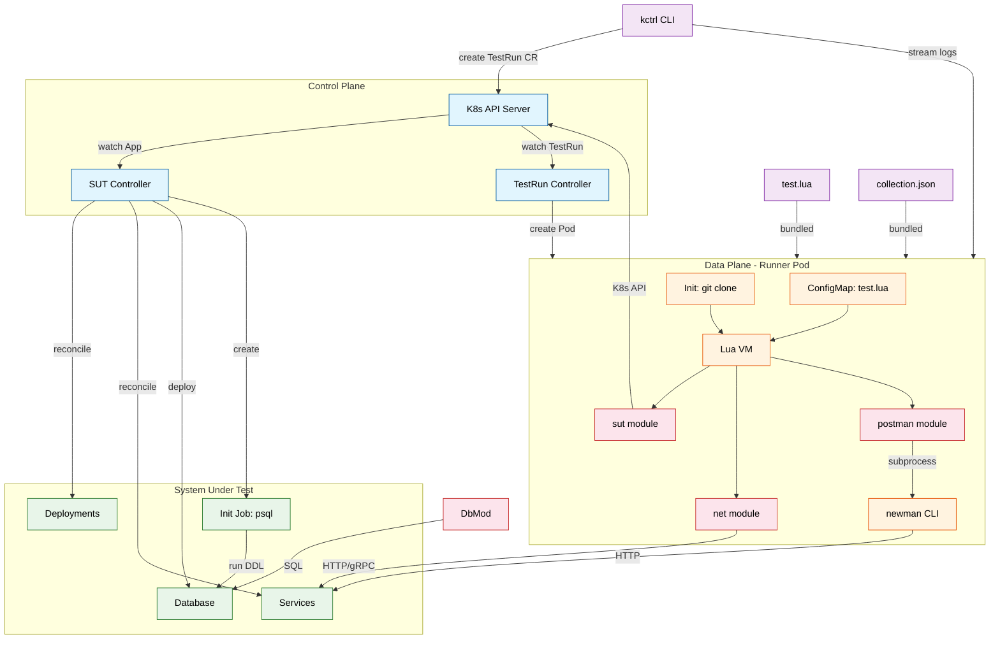
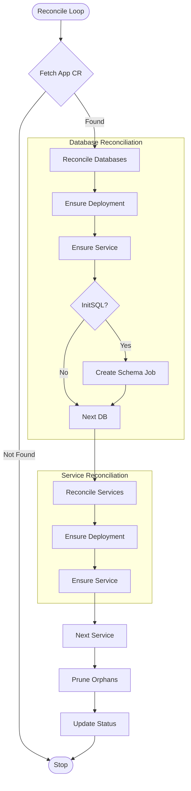
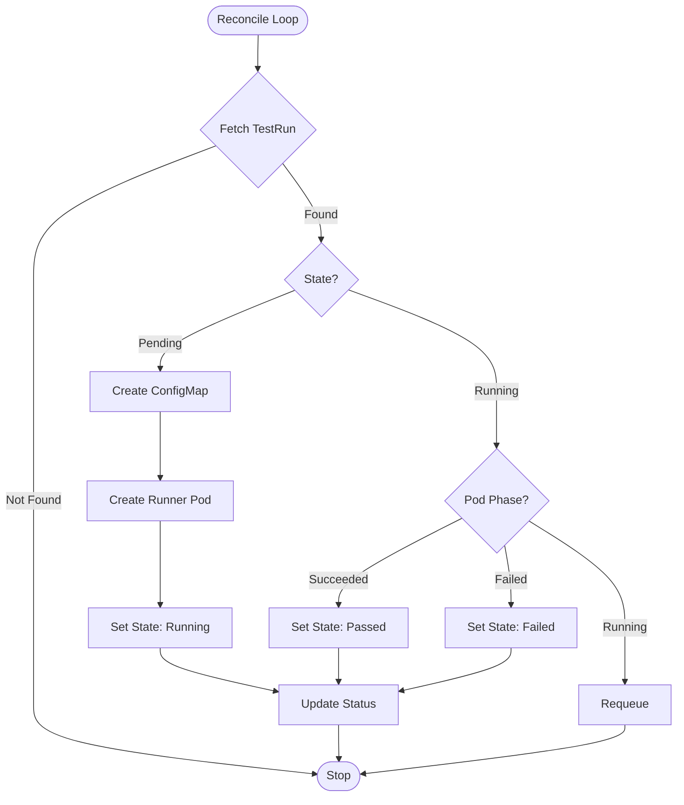

# System Design: Test Orchestration Platform (TOPAS)

This document outlines the architecture for a platform that orchestrates granular system tests using Kubernetes and Lua scripting.

## 1. Core Concept
The platform consists of two main components:
1.  **System Controller (SUT)**: Manages the lifecycle of the application under test (the "App").
2.  **Test Framework**: A Lua-based scripting environment invoked via CLI to execute complex test scenarios (upgrades, state verification, etc.).

### Architecture Diagram



---

## 2. System Under Test (SUT) Controller

The `App` CRD acts as the "Inventory" and "Control Plane" for the system being tested.

### `App` CRD
- **Purpose**: Defines the stack of composed services and databases.
- **Schema**:
    ```go
    type ServiceSpec struct {
        Name     string            `json:"name"`
        Image    string            `json:"image"`
        Version  string            `json:"version"`
        Replicas *int32            `json:"replicas,omitempty"`
        Port     int32             `json:"port"`
        EnvVars  map[string]string `json:"envVars,omitempty"`
    }
    
    type DatabaseSpec struct {
        Name        string            `json:"name"`
        Image       string            `json:"image"`       // e.g. postgres:16-alpine
        Port        int32             `json:"port"`
        Credentials map[string]string `json:"credentials"` // user, password, dbname
        InitSQL     string            `json:"initSQL,omitempty"`
    }
    
    type AppSpec struct {
        Services  []ServiceSpec  `json:"services"`
        Databases []DatabaseSpec `json:"databases,omitempty"`
    }
    ```
- **Controller Logic**:
    - Reconciles `Services[]` → Kubernetes `Deployment` + `Service` pairs.
    - Reconciles `Databases[]` → `Deployment` + `Service` + one-time **init Job** (runs `psql` with `InitSQL`).
    - Injects env vars (e.g. `POSTGRES_USER/PASSWORD/DB`) into database containers.
    - Injects `EnvVars` (e.g. `DATABASE_URL`) into service containers.
    - **Self-Healing**: Ensures the deployed version always matches the spec.
    - **Scope**: Manages schema (DDL) but not database software versioning (e.g. Postgres 15→16).
    
### Reconciliation Logic



---

## 3. Test Framework Architecture

We enable users to write procedural test scripts in **Lua** that can manipulate the SUT and verify state. This framework is designed to handle complex scenarios involving database state, network interactions, and system versioning.

### Reconciliation Logic



### Components
1.  **CLI (`kctrl`)**:
    -   `kctrl test schedule --script test.lua --app my-app` — Reads the script file, creates a `TestRun` CR.
    -   `kctrl test logs <run-name>` — Streams runner pod logs in real-time.
    -   `kctrl test status <run-name>` — Shows State, Result, Duration.
2.  **`TestRun` CRD**:
    -   Represents a scheduled test execution.
    -   **Spec**:
        -   `appName`: Target App CR name (required).
        -   `script`: Inline Lua script content.
        -   `git`: Git source (URL, path, revision).
        -   `timeout`: Max execution time (enforced via `activeDeadlineSeconds`).
    -   **Status**: `Pending`, `Running`, `Passed`, `Failed`, `Error`.
3.  **Test Controller**:
    -   Watches `TestRun` resources.
    -   For inline scripts, creates a **ConfigMap** containing the Lua script.
    -   Spawns an ephemeral **Test Runner Pod** with the script mounted as a volume.
    -   Sets `activeDeadlineSeconds` on the pod from the `timeout` field.
    -   Monitors pod phase and updates TestRun status (via owner references + requeue).
4.  **Test Runner Pod**:
    -   Runtime environment with embedded **Lua VM** (`gopher-lua`).
    -   Pre-loaded **Lua API** bindings.
    -   Receives `--app` and `--namespace` arguments from the controller.

### Lua API Capabilities
The framework exposes a rich API to control the environment:

#### 1. System Control (SUT)
Manipulate the system version and scale.
```lua
local sut = require("sut")
-- Update the 'frontend' service to a specific version
sut.apply_service("frontend", { 
    image = "my-org/web", 
    version = "v1.2.0", 
    replicas = 3 
})
-- Wait for rollout to complete
sut.wait_ready("frontend", "60s")
```

#### 2. Unified Network Client
Simple, intuitive access to services via HTTP or gRPC.

```lua
local net = require("net")

-- HTTP: Standard verbs
local resp = net.get("http://frontend/api/users/alice")
assert(resp.code == 200)

-- gRPC: Simple call semantics
local g_resp = net.grpc("mock-app-echo:50051", "topas.EchoService/Echo", { 
    message = "hello" 
})
assert(g_resp.message == "hello")
```

#### 3. Database State
Direct SQL access for seeding and verification.
```lua
local db = require("db")

-- Seed
db.connect({ host="mock-app-db", user="admin", db="testdb" })
db.seed({ 
    table="users", 
    rows={{name="alice", role="admin"}} 
})

-- Verify
db.expect({ 
    table="users", 
    where={name="alice"} 
})
```

#### 4. Postman Collections
Execute existing Postman test suites from within Lua.
```lua
local pm = require("postman")

local passed, report = pm.run({
    collection  = "tests/api-tests.json",
    environment = "tests/staging.env.json",
    folder      = "Login Flow",
})

if not passed then error("Postman tests failed!") end
```


## 4. Workflows

### User Journey
1.  **Deploy SUT**: User applies `app.yaml` to create the initial stack (services + databases).
    - SUT controller deploys Postgres, runs init Job with `initSQL` schema.
    - SUT controller deploys app services with `DATABASE_URL` env var.
2.  **Write Test**: User writes `upgrade_test.lua`.
3.  **Run Test**: User runs `kctrl test schedule --script test.lua --app my-app`.
    - CLI creates `TestRun` CR.
4.  **Execution**:
    - Controller creates Pod.
    - Pod runs Lua script.
    - Script interacts with `App` CR, Pods, and Database.
5.  **Result**: CLI streams logs and reports Pass/Fail.

---

## 5. Deployment & Scaling Architecture

TOPAS is designed to scale horizontally to handle thousands of concurrent tests.

### Control Plane
-   **TOPAS Controller**: Deployed as a Kubernetes Deployment (default 1 replica with leader election for HA).
-   **Responsibility**:
    -   Watches `TestRun` CRs.
    -   Manages the "Queue" by reconciling `Pending` runs.
    -   Enforces concurrency limits (e.g., max 50 concurrent tests).

### Data Plane (Execution)
We support two execution models based on scale:

#### 1. Standard Scale (Current)
*   **Model**: 1 Test = 1 Pod.
*   **Pros**: Perfect isolation, simple lifecycle.
*   **Limit**: ~50 concurrent tests/sec (Cluster dependent).

#### 2. High Scale (Targeting 500+ tests/sec)
To handle multi-tenant high throughput, we bypass Pod churn:
*   **Queue**: **Kafka**, **NATS JetStream**, or **Redis Streams** (External to API Server).
*   **Workers**: Long-running **Executor Pods** (e.g., 100 replicas).
*   **Flow**:
    1.  API pushes test payload to Queue (e.g., Kafka topic `tests.pending`).
    2.  Idle Executor pulls task.
    3.  Executor creates isolated Lua VM context.
    4.  Runs script.
    5.  Reports result async.
*   **Isolation**: Lua VM constraints (vs Docker isolation).

### Queueing Mechanism
1.  **Submission**: User submits a test → `TestRun` CR created (State: `Pending`).
2.  **Queue**: Kubernetes API Server acts as the persistent queue.
3.  **Scheduling**: Controller picks up `Pending` CRs. If `ActiveTests < MaxConcurrency`, creates a Runner Pod and moves state to `Running`.

---

## 6. Git Integration & Test Organization

Tests are treated as code and organized in Git repositories.

### `TestRun` Spec Update
Support fetching scripts from Git:

```go
type GitSource struct {
    URL      string `json:"url"`      // e.g. https://github.com/org/tests.git
    Path     string `json:"path"`     // e.g. scenarios/upgrade.lua
    Revision string `json:"revision"` // e.g. main, v1.2, or commit-sha
}

type TestRunSpec struct {
    AppName   string     `json:"appName"`          // Target App CR name
    Script    string     `json:"script,omitempty"` // Inline script (optional)
    Git       *GitSource `json:"git,omitempty"`    // Git source
    Timeout   string     `json:"timeout,omitempty"`
}
```

### Execution Flow

**Inline Script:**
1.  `kctrl test schedule --script test.lua --app my-app`
2.  CLI reads file, creates `TestRun` CR with inline `script` content.
3.  Controller creates a **ConfigMap** with the script, mounts it into the runner pod.
4.  Runner executes the script from the mounted volume.

**Git Source:**
1.  `kctrl test schedule --git https://github.com/org/tests --git-path upgrade.lua --app my-app`
2.  Runner starts with an **Init Container** that clones the repo to a shared volume.
3.  Main container executes the Lua script from the cloned volume.

---

## 7. Monitoring & Observability

Users need visibility into the test queue and execution results.

### CLI Tools
-   `kctrl test status`: Lists recent runs with state (Pending, Running, Passed, Failed).
-   `kctrl test logs <id>`: Streams logs from the execution.

### Metrics (Prometheus)
The Controller exposes standard metrics:
-   `topas_queue_depth`: Number of pending tests.
-   `topas_active_runners`: Number of currently running tests.
-   `topas_test_duration_seconds`: Histogram of execution time.

---

## 8. Postman Integration (Lua-Driven)
Postman collections are executed **inside the runner container** as a subprocess, orchestrated by Lua.

### Execution Model
```
Runner Pod (single container)
└── topas-runner
    ├── Go binary: /runner --script test.lua
    │   └── Lua VM
    │       ├── pm.run()   → exec newman (subprocess)
    │       ├── db.seed()  → direct SQL connection
    │       └── sut.wait() → K8s API
    └── newman CLI (pre-installed in image)
```

### Runner Image
The `topas-runner` Docker image includes Node.js and Newman alongside the Go runner binary.

### Why Lua Drives
- **DB access**: Lua's `db` module seeds/verifies data — Postman cannot connect to databases natively.
- **K8s orchestration**: Lua's `sut` module manages deployments before/after tests.
- **Conditional logic**: Run different collections based on prior results.
- **No CRD changes**: `TestRun` stays simple; Postman is just another Lua module.

---

## 9. Future Work
### Web Dashboard
-   Visualize `TestRun` history.
-   Show real-time logs (WebSocket).
-   Pass/Fail rates and drill-down.
